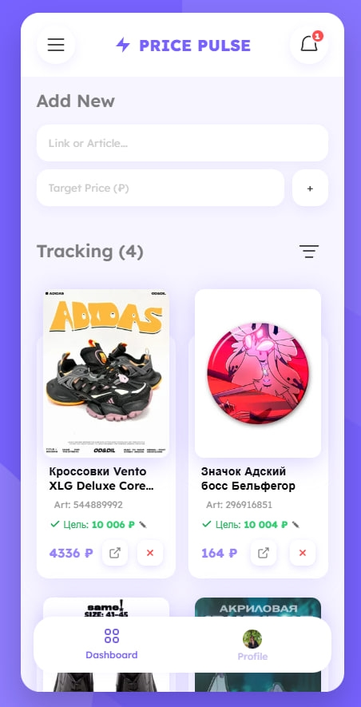
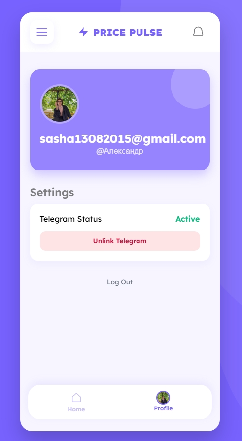
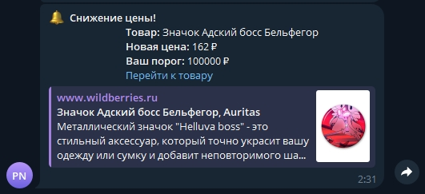
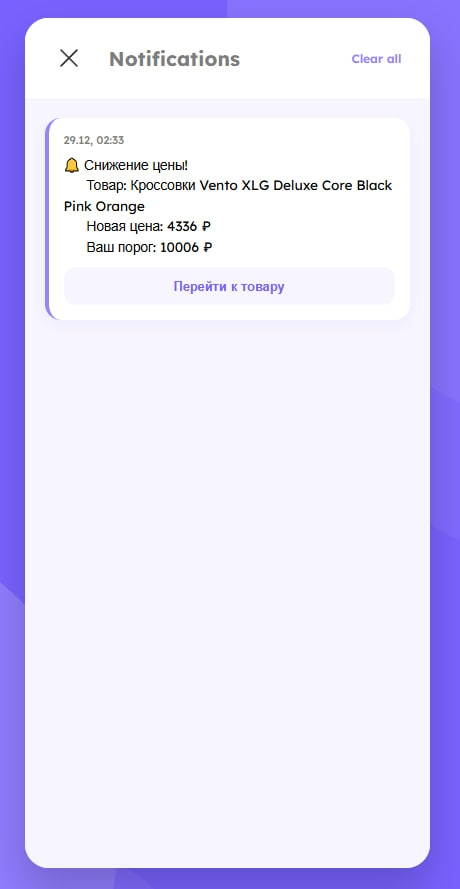

# PricePulse

**PricePulse** – PWA приложение для отслеживания цен на товары в Wildberries.

Приложение позволяет добавить товар по артикулу или ссылке, указать желаемую цену и получать уведомление в Telegram, когда стоимость товара опустится ниже заданного значения.

Проект создан как pet-project для практики разработки full-stack приложения на TypeScript с React, Node.js, PostgreSQL и Docker.

## Возможности

* Авторизация через Telegram
* Добавление товаров Wildberries по артикулу или ссылке
* Отслеживание текущей цены товара
* Установка пороговой цены для каждого товара
* Автоматическая фоновая проверка цен
* Уведомления в Telegram при снижении цены
* Просмотр списка отслеживаемых товаров
* PWA-интерфейс
* Запуск всего проекта через Docker Compose

## Как это работает

Типовой сценарий пользователя выглядит так:

```text
Авторизация через Telegram
           ↓
Добавление товара (ссылка WB/артикул)
           ↓
Установка порога желаемой цены
           ↓
Фоновая проверка текущей цены товара
           ↓
Если цена ниже порога, уведомление в tg
```

## Интерфейс

### Список отслеживаемых товаров

Здесь пользователь видит добавленные товары, их текущую цену и установленный порог.

Товар можно добавить по артикулу Wildberries или вставить ссылку на страницу товара.

Для каждого товара можно задать цену, при достижении которой нужно отправить уведомление.



### Профиль пользователя

Здесь пользователь может привязать свой аккаунт Telegram для получения уведомлений от бота.



### Уведомление в Telegram

Когда текущая цена становится равна или ниже установленного порога, пользователь получает сообщение от Telegram-бота и уведомление в приложении.





## Стек

### Frontend

* **React 19**
* **TypeScript**
* **Vite**
* **React Router**
* **Framer Motion**
* **PWA**

### Backend

* **Node.js**
* **TypeScript**
* **Express**
* **Sequelize**
* **PostgreSQL**
* **JWT**
* **Telegraf**
* **node-cron**
* **Puppeteer**

### Infrastructure

* **Docker**
* **Docker Compose**
* **PostgreSQL**

Frontend и backend разделены на отдельные приложения и запускаются как самостоятельные Docker-сервисы. PostgreSQL также запускается в отдельном контейнере.

Фоновая проверка цен выполняется на стороне backend. Для периодических задач используется `node-cron`, а взаимодействие с Telegram реализовано через Telegraf. Для парсинга данных о товарах используется Puppeteer.

## Структура проекта

```text
PricePulse/
├── backend/
│   ├── src/
│   ├── Dockerfile
│   └── package.json
│
├── frontend/
│   ├── src/
│   ├── Dockerfile
│   └── package.json
│
├── postgres_data/
│
├── docker-compose.yml
└── README.md
```

Frontend и backend имеют отдельные `package.json` и собираются независимо. В frontend используется Vite, а backend компилируется TypeScript-компилятором.

## Запуск

Для запуска необходимы:

* Docker
* Docker Compose

Клонировать репозиторий:

```bash
git clone https://github.com/duvean/PricePulse.git
cd PricePulse
```

Запустить проект:

```bash
docker compose build
docker compose up
```

После запуска:

```text
Frontend: http://localhost:5173
Backend:  http://localhost:3000
PostgreSQL: localhost:5432
```

Docker Compose автоматически запускает три сервиса:

```text
frontend
backend
db
```

## Telegram-авторизация

Для авторизации используется Telegram.

После авторизации пользователь связывается с Telegram-аккаунтом, что позволяет приложению в дальнейшем отправлять ему уведомления о снижении цены.

Telegram также используется как канал уведомлений: отдельный бот сообщает пользователю, когда отслеживаемый товар достигает установленного ценового порога.

## Docker

Весь проект запускается через Docker Compose.

Конфигурация включает:

```text
PostgreSQL 15
     │
     ├── Backend :3000
     │
     └── Frontend :5173
```

Это позволяет развернуть приложение на новой машине без отдельной установки Node.js, PostgreSQL и зависимостей проекта.

## Что было реализовано

В рамках проекта реализованы следующие части:

* frontend на React + TypeScript;
* REST API на Node.js + Express;
* JWT-аутентификация;
* интеграция с Telegram;
* хранение пользователей и отслеживаемых товаров в PostgreSQL;
* ORM через Sequelize;
* автоматические фоновые задачи;
* получение актуальной информации о товарах Wildberries;
* система пороговых цен;
* Telegram-уведомления;
* Docker-контейнеризация frontend, backend и базы данных;
* PWA-интерфейс.

## Локальная разработка

Frontend:

```bash
cd frontend
npm install
npm run dev
```

Backend:

```bash
cd backend
npm install
npm run dev
```

Сборка frontend:

```bash
npm run build
```

Сборка backend:

```bash
npm run build
```

Доступные npm-команды и зависимости определены непосредственно в `package.json` обоих приложений.

## Статус проекта

Pet-project / учебный full-stack проект.

Основная цель проекта – практика разработки приложения, объединяющего frontend, backend, базу данных, внешние API/сервисы, фоновые задачи и контейнеризацию.

---

## Автор

**duvean**

[GitHub](https://github.com/duvean)


